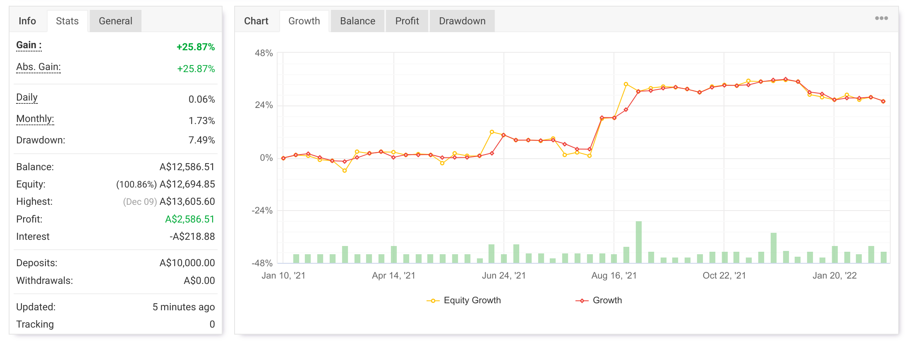

# Simple MACD Cross Autotrader

MetaTrader 4 expert advisor for trading MACD zero-line crosses with fractal-based pending orders.

## Screenshot



## Overview

This EA is designed for higher time frames, primarily `H4` and `D1`.

The core idea is:

- detect a MACD cross above or below the zero line
- find the most relevant fractal before the cross
- place pending orders around that fractal structure

This approach can work well as a discretionary trading framework, but the bot performs best with supervision and is less reliable in ranging markets.

## Strategy Notes

- Focused on higher time frames rather than intraday scalping
- Uses fractals, MACD, and additional filters from the shared dependency files
- Better suited to trending conditions than sideways price action
- Includes configurable stop loss and trailing stop behaviour in code

## Project Structure

- [Simple-Macd-Cross.mq4](./Simple-Macd-Cross.mq4): main expert advisor
- [dependencies/](./dependencies): shared `.mqh` include files used by the EA
- [macd_cross-2022-02.png](./macd_cross-2022-02.png): chart screenshot

## Installation

1. Copy [Simple-Macd-Cross.mq4](./Simple-Macd-Cross.mq4) into your MT4 `Experts` folder.
2. Copy the [dependencies/](./dependencies) folder beside the EA file so the structure stays:

   ```text
   Experts/
   └── Simple-Macd-Cross/
       ├── Simple-Macd-Cross.mq4
       └── dependencies/
   ```
3. Open the EA in MetaEditor and compile.
4. Attach the EA to an `H4` or `D1` chart and review inputs before enabling live trading.

## Current Include Setup

The EA currently includes files from `dependencies/` using local relative paths like:

```mq4
#include "dependencies/DAN4-common_def.mqh"
```

That layout matches the files in this repository. The dependency filenames still use the older `DAN4` naming convention, but the paths are internally consistent.

## Warning

This is an experimental trading bot. Test it on demo first and review risk settings carefully before using it on a live account.
